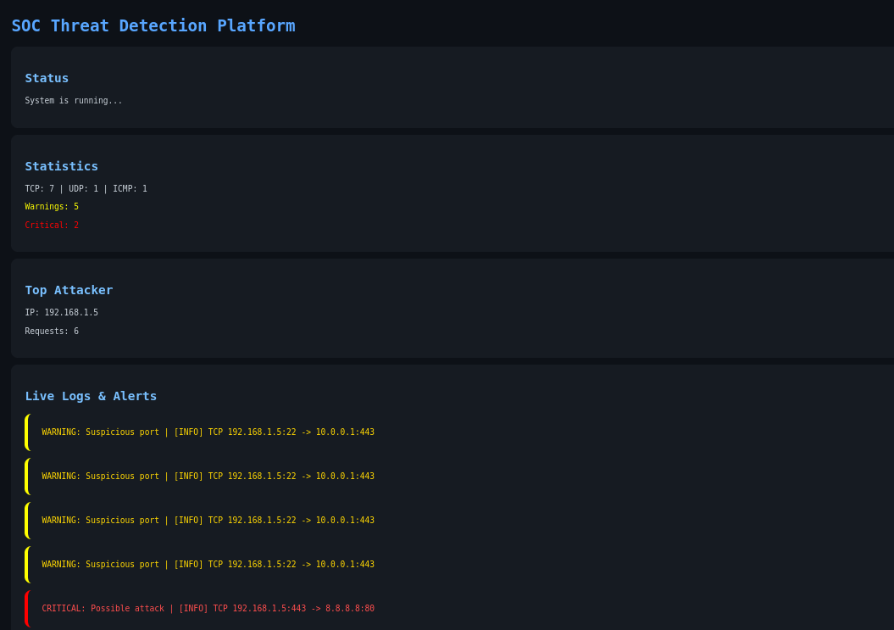

# SOC Threat Detection Platform

## Overview

SOC Threat Detection Platform is a Python-based cybersecurity system that monitors network logs, detects suspicious activity, and visualizes threats in a web dashboard.

This project simulates a basic Security Operations Center (SOC) tool used for real-time monitoring and threat detection.

---

## Dashboard Preview

---

## Features

-  Real-time log monitoring
-  Threat detection engine
- ⚠️ Warning alerts (suspicious ports)
- 🔴 Critical alerts (repeated activity / attack patterns)
-  Protocol statistics (TCP, UDP, ICMP)
-  Top attacker IP detection
-  Visualization using charts

---

## Technologies Used

- Python
- Flask
- Chart.js
- HTML/CSS
- Jinja2

---

## Project Structure

soc-threat-platform
│
├── app.py
├── templates/
│ └── index.html
├── detection/
│ └── detector.py
├── logs/
│ └── sample.log
├── dashboard.png
└── README.md

---

## Installation

Clone the repository:

git clone https://github.com/Pravat25/soc-threat-platform.git

Navigate into project:

cd soc-threat-platform

Create virtual environment:

python3 -m venv venv
source venv/bin/activate

Install dependencies:

pip install flask

---

## How to Run

python app.py

Open browser:

http://127.0.0.1:5000

---

## Learning Outcomes

This project demonstrates:

- Security monitoring concepts (SOC)
- Log analysis and threat detection
- Web-based dashboard development
- Data visualization for cybersecurity

---

## Disclaimer

This project is for educational purposes only.
